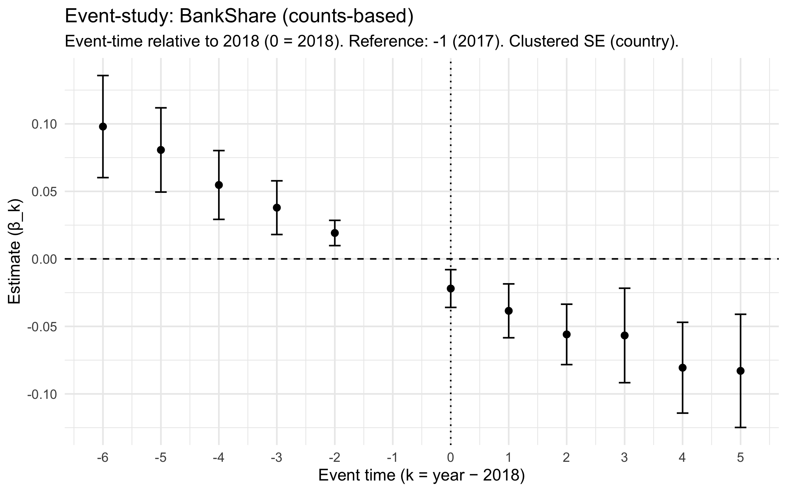
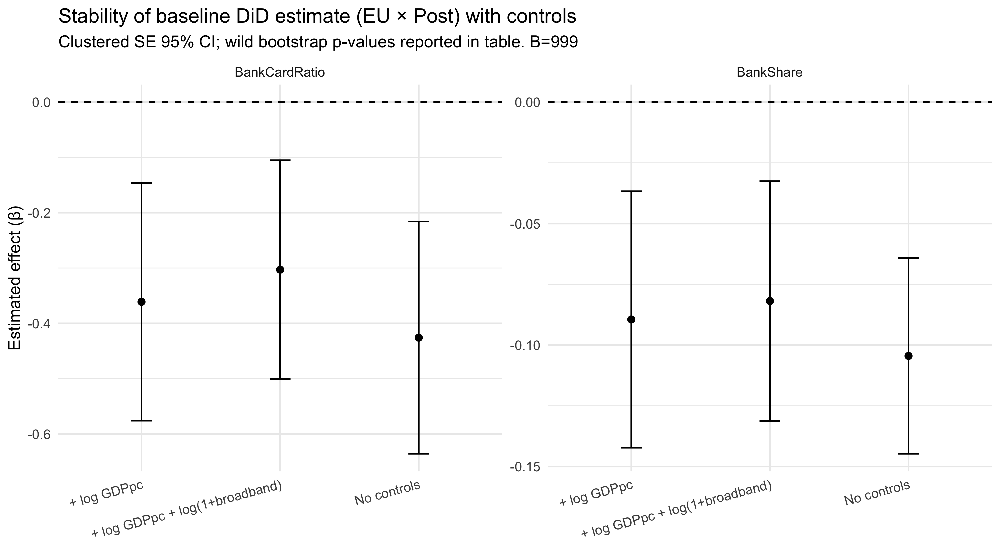
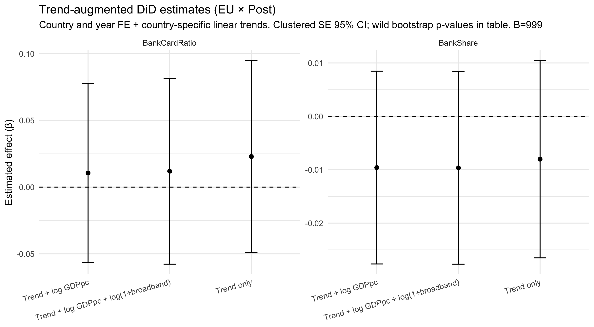
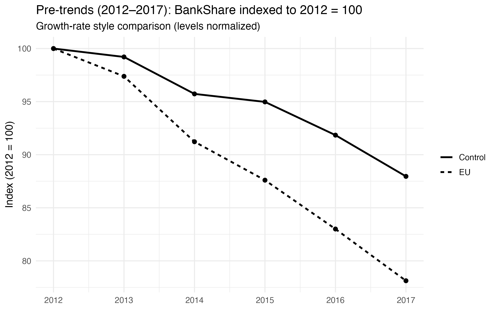

## Full Thesis

📄 [Download the full thesis (PDF)](psd2_master_thesis.pdf)

# EU PSD2 Payment Effects

This project evaluates whether the EU's Second Payment Services Directive (PSD2), implemented in 2018, increased the adoption of bank-based payments relative to card payments.

The analysis uses cross-country panel data (2012–2023) and a difference-in-differences design comparing EU countries with non-EU control countries.

This repository contains the full reproducible empirical pipeline for the master's thesis:

"Did PSD2 Increase the Adoption of Bank-Based Payments Relative to Card Payments in Europe?"
Stockholm University — MSc Economics (Econometrics Track)

## Research Question

Did PSD2 increase the use of bank-based payments relative to card payments in Europe?

## Contribution

This project demonstrates how standard difference-in-differences estimates can be misleading in the presence of differential pre-trends. By incorporating country-specific trends and combining event-study and placebo diagnostics, the analysis provides an identification-aware re-evaluation of PSD2's effects.

## Identification Strategy

The empirical strategy uses a difference-in-differences framework:

Y_ct = α + β (EU_c × Post_t) + μ_c + τ_t + ε_ct

EU_c = EU country indicator  
Post_t = post-2018 period

Outcome variables:

• BankShare = credit transfers / (credit transfers + card payments)  
• BankCardRatio = credit transfers / card payments

To address differential pre-trends between EU and control countries, the analysis additionally includes specifications with country-specific linear time trends.

## Main Results

The empirical analysis finds no evidence that PSD2 generated a measurable shift toward bank-based payments at the aggregate level.

Event-study estimates show no structural break around the 2018 implementation, with payment dynamics continuing along pre-existing trends.

While baseline difference-in-differences estimates suggest negative effects, these are driven by differential pre-trends between EU and control countries. Once country-specific trends are accounted for, the estimated treatment effects attenuate toward zero.

Overall, the findings indicate that PSD2 did not produce a detectable change in payment composition in the short to medium run.

## Key Empirical Results

### Event Study (Primary Result)

Dynamic treatment effects relative to the PSD2 implementation year.  
No clear structural break is observed at 2018, and post-treatment coefficients remain close to zero.

---

### Baseline DiD with Controls

Coefficient stability across baseline and controlled specifications.  
Estimates are consistently negative, but remain statistically insignificant.

---

### Trend-Augmented DiD

Including country-specific linear trends substantially attenuates the estimated effects toward zero, suggesting that baseline estimates reflect pre-existing dynamics rather than causal impact.

---

### Pre-Trends Diagnostic

Indexed payment shares for EU and control countries prior to PSD2.  
EU countries exhibit a declining relative trend, indicating violation of parallel trends.

---

The direct comparison between baseline and trend-augmented specifications is reported in `tab17g_baseline_vs_trend_augmented_raw.csv`, which documents the attenuation of the estimated treatment effects once country-specific trends are included.

## Repository Structure

- `R/` – empirical pipeline scripts  
- `data/` – raw and processed datasets  
- `figures/` – main output figures used in the README  
- `outputs/` – tables and intermediate outputs  
- `paper/` – final thesis PDF  

## Reproducibility

The entire pipeline can be executed sequentially using the scripts in the `scripts/` folder.

Package versions are managed using `renv`.

## Full Pipeline Documentation

A detailed description of the full empirical pipeline is available in:

pipeline_documentation.md
